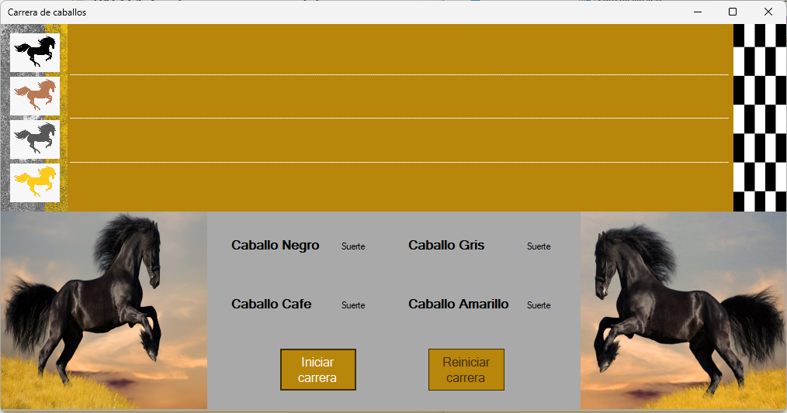

# 🐎 Carrera de Caballos con Hilos

Este proyecto simula una carrera de caballos utilizando programación concurrente con **hilos en C#**.

Cada caballo corre en un hilo independiente, mostrando visualmente el avance hasta la meta.

---

## 📷 Captura del Programa

---

## 🛠 Tecnologías usadas

- C# (.NET Framework)
- Windows Forms
- Programación multihilo (`Thread`)

---

## 🚀 Cómo ejecutar

1. Abre el proyecto con Visual Studio
2. Compila y ejecuta (F5)
3. Observa cómo los caballos compiten de forma paralela

---

## ✍️ Autor

- Carlos Alberto Medina Beltran
